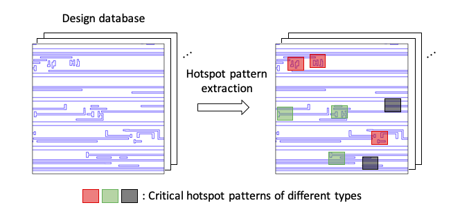
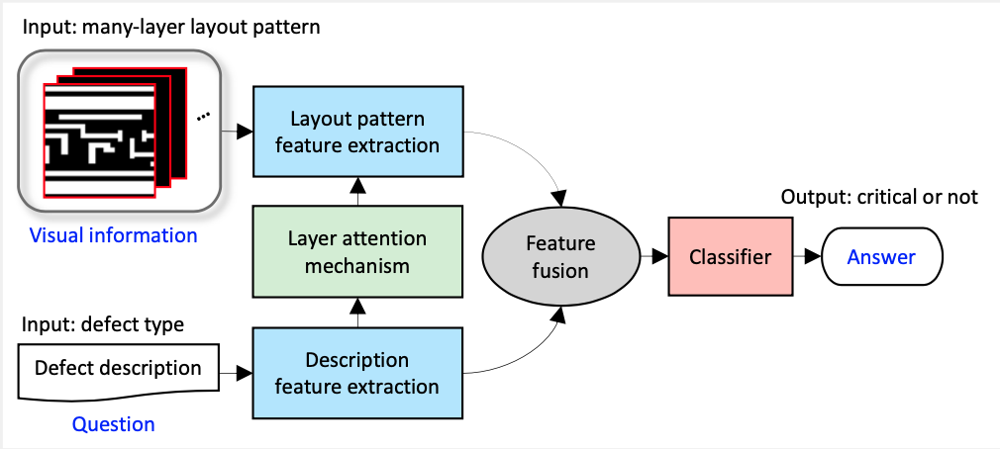
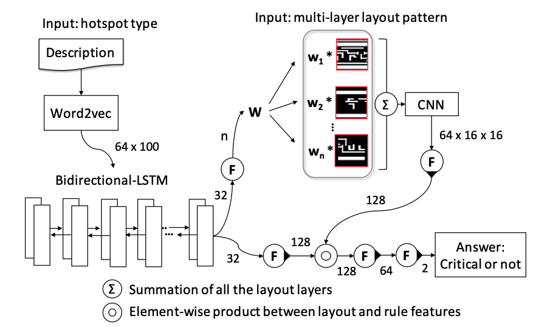
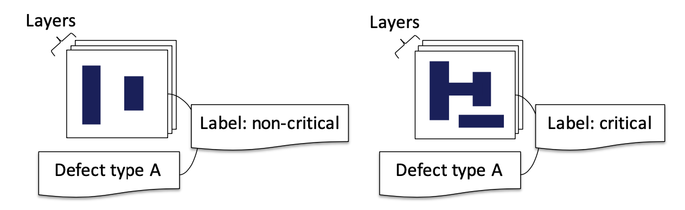

# Many-Layer Hotspot Detection by Layer-Attentioned Visual Question Answering

## Background:

Identifying hotspot patterns and correcting them as early as possible is crucial in ensuring yield and manufacturability in electronic design automation (EDA). Traditional hotspot detection methods often focus on individual layers or adjacent layers, overlooking the complex interactions between multiple layers in modern layouts.

  

## Approach:

We formulate the task of many-layer critical hotspot pattern extraction as a visual question answering (VQA) problem. Treating a many-layer layout pattern as an image and a defect type as a question, our approach introduces a layer-attentioned VQA model.

  

## Key Features:

- **Deep Learning:** Harness the power of deep learning for analyzing complex layout patterns.
- **Computer Vision and NLP:** Integrate computer vision and NLP techniques to bridge the gap between visual patterns and textual queries.
- **Attention Mechanism:** Utilize a layer attention mechanism to dynamically highlight the importance of each layer in hotspot detection, enhancing model interpretability and performance.

  

## Dataset:

The dataset used in this study was collected from 7 layouts with sub-14nm process. It was divided into training and testing sets with an 80-20 split. The dataset consists of 57 defect types selected as queried types. There are 38 layout layers that are possibly involved in the selected defect types. In total, the dataset contains 79,593 triple data points. In the testing set, 480 patterns were labeled to 57 defect types, resulting in 27,360 pattern-defect pairs.

  

## Results:

Experimental results showcase the superior question-answering ability of our proposed model. It surpasses existing methods on modern layouts with more than thirty layers, demonstrating its effectiveness in hotspot detection and defect type identification. 
Because prior works do not handle many-layer patterns, we compare our layer-attentioned VQA model with the baseline VQA model.

## Usage:

To replicate our experiments or apply our method to your own datasets, refer to the instructions provided in the `README.md` file and explore the provided codebase.

## Citation:

Y. -S. Chen and I. H. -R. Jiang, "Many-Layer Hotspot Detection by Layer-Attentioned Visual Question Answering," 2022 Design, Automation & Test in Europe Conference & Exhibition (DATE), Antwerp, Belgium, 2022, pp. 604-607, doi: 10.23919/DATE54114.2022.9774622.

## Keywords:

Deep Learning; Visual Question Answering; Natural Language Processing; Computer Vision; Attention Mechanism; Electronic Design Automation; VLSI Layout; Hotspot Detection

